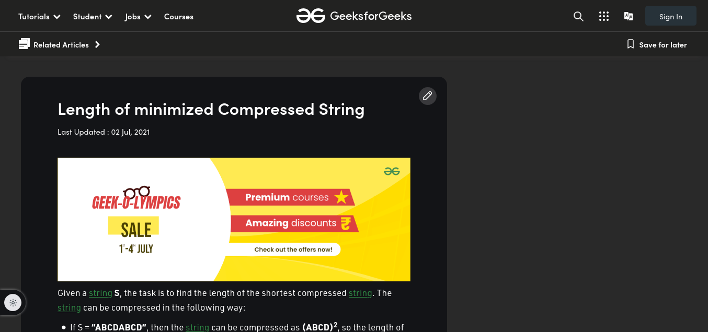
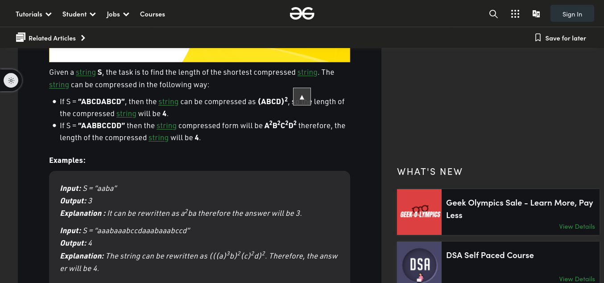
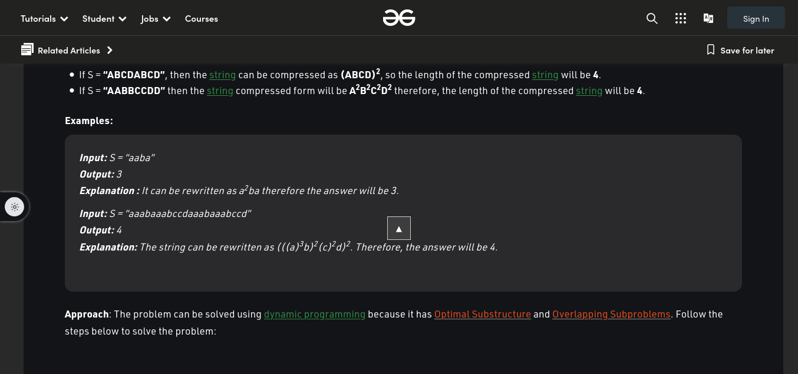

# **GFGDebloater**

A Simple UX improvement and de-bloater extension Firefox meant for the geeksforgeeks.org site. Once a good site, the current UI makes it tedious to read articles as promotions, ads, and recommended pages greatly reduce the content viewport. This extension removes all the bloat and makes the article take up the whole screen (100% width instead of the original 65%).

## **Examples**
Simple demo showing the before and after of the de-bloating.

### **Banners**
Banners are the site promotions as seen in the screenshot.

#### **Before**
</img>

#### **After**
</img>

### **Sidebar**
The sidebar is the area that appears to the right of the article (remaining 35% of the viewport).

#### **Before**
</img>

#### **After**
</img>

## **All Changes**
- Removal of side banner.
- Removal of Sign Up and Login bloat.
- removal of ad banner at the start of the article.

## **Installation**
Installation and setup could be achieved by either running the the build locally or via Jenkins (via the Jenkinsflie).

### **Manual Signing**
1. Install and setup nodejs and npm on the system.
2. Clone the repo and install the dependencies via `npm install`.
3. Create a Firefox developers account and [obtain WRT issuer and WRT secret API keys]('https://addons.mozilla.org/en-US/developers/addon/api/key/'). Export, as enviornmental varaibles, the two keys under the env variables `WEB_EXT_API_KEY` and `WEB_EXT_API_SECRET` respectively. 
4. Sign the extension via the command `npm run sign-ext`. After a few minutes , the signed extension would be downloaded to `web-ext-artifacts/`. The packaged`.xpi` extension could now be loaded into Firefox.

### **Jenkins Integration**
1. Install and setup nodejs and npm on the system.
2. Clone the repo and install the dependencies via `npm install`.
3. Create a Firefox developers account and [obtain WRT issuer and WRT secret API keys]('https://addons.mozilla.org/en-US/developers/addon/api/key/'). Save these two API keys as secrets named `jwt-firefox-dev-issuer` and `jwt-firefox-dev-secret` respectively.
4. Upon parameterizing the job and supplying the `BRANCH` to build, the job could be built. If successful, the extension would be saved as an artifact. 